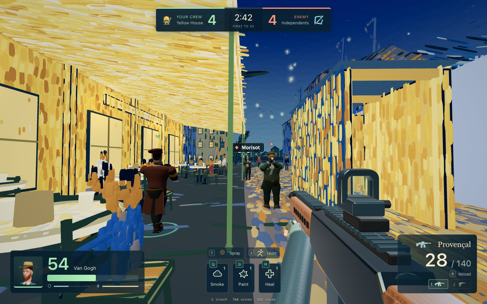

# Gogh Strike

**Twelve artists. Two rival crews. One paint fight.**

A painterly six-versus-six browser shooter set in Van Gogh’s Town. Pick an artist, grab their signature weapon, and turn the café streets into a three-minute rivalry.

### [Play Gogh Strike →](https://gogh-strike.surge.sh/)

No install required · Desktop keyboard and mouse · Single-player with bots



Join five bots against a rival crew. First to **20 eliminations**, or the higher score after **three minutes**, wins. Two-second respawns keep you in the fight. Sprint, slide, throw paint bursts, and leave your artist’s tag on the walls.

## Choose your artist

Join **The Yellow House** or **The Independents**. Each artist comes with a signature primary weapon, a pistol, their own art tag and a victory dance. Pick your favourite and press **Play**—the compact 3–2–1 countdown lets you look around before the match begins.


## Meet the artists

Get a closer look through **Inspect artist**. The studio uses the same models you meet in the game, with face, full-body, walking and crouching views.

<p align="center">
  
</p>

| Weapon | The Yellow House | The Independents |
| --- | --- | --- |
| Provençal assault rifle | Van Gogh, Signac | Monet, Pissarro |
| Mistral SMG | Gauguin, Toulouse-Lautrec | Renoir, Cassatt |
| Harvester shotgun | Cézanne | Degas |
| Nocturne precision rifle | Seurat | Morisot |

All twelve have distinct builds, faces, clothes, movement weights, graffiti and dances. The artists are real; their teams, weapons, costumes and rivalry are imagined. Physiques are character-design interpretations, not authenticated measurements. Explore the references in the [art-world guide](docs/ART-WORLD.md), [character notes](docs/characters/) and [tag guide](docs/ARTIST-TAGS.md).

## Controls

| Input | Action |
| --- | --- |
| W / A / S / D; mouse | Move; look |
| Left mouse; hold right mouse | Fire; aim down sights |
| Shift + forward; Space | Sprint; jump |
| Hold C or Ctrl | Crouch; crouch while sprinting to slide |
| R; 1 / 2 or mouse wheel | Reload; switch primary and pistol |
| B; I; V | Fire selector; inspect weapon; melee |
| Q / G; hold H while still | Smoke / paint burst; heal |
| T; J | Spray your art tag; perform your victory dance |
| Hold Tab; Esc | Scoreboard; pause / resume |

Crouching tightens both actual shot spread and the reticle. Sprinting and sliding prevent firing. Teammates block bullets without taking friendly-fire damage. Your own paint burst can hurt you. Firing and other aggressive actions end spawn protection.

Spawn with 100 displayed health and 50 armour. Eliminations restore up to 10 health; health also regenerates after 4.5 seconds without damage. Each artist has one primary weapon and a pistol; weapons, ammunition and utility charges refill on respawn.

Settings control sensitivity, volume and brushwork quality. Switching apps pauses the match and clears held inputs. If the browser releases the mouse, click the resume prompt to capture it again. Mobile touch controls and online multiplayer are not implemented: this is a single-human game against bots.

## Play locally

Requires Node.js 20+ and a desktop browser with hardware-accelerated WebGL, a keyboard and a mouse.

```sh
git clone https://github.com/petergpt/gogh-strike.git
cd gogh-strike
npm start
```

Open **http://127.0.0.1:8967/**. The runtime and models are bundled; you do not need to install dependencies just to play. Use `PORT=8968 npm start` for another port. The first online load downloads approximately 36 MB of game assets; subsequent visits can reuse the browser cache.

## Develop and deploy

```sh
npm ci
npm test
npm run build
```

`dist/` is a standalone static site for Surge or another static host. Build output includes only browser files and license notices; developer tools and source scenes are excluded. To publish with your own authenticated Surge account:

```sh
surge dist https://your-game.surge.sh
```

[Development notes](docs/DEVELOPMENT.md) cover the architecture and character tools. Prebuilt GLBs and portraits are checked in. The Blender builders and official CC0 anatomy sources are included so you can regenerate the models and an editable `.blend` scene; Blender is not needed to run the game.

## License and source

Original code and artwork are [MIT licensed](LICENSE). Three.js retains its MIT notice; MakeHuman’s anatomical base and morph targets are CC0. See [third-party notices](THIRD_PARTY_NOTICES.md) and [provenance](PROVENANCE.md).
